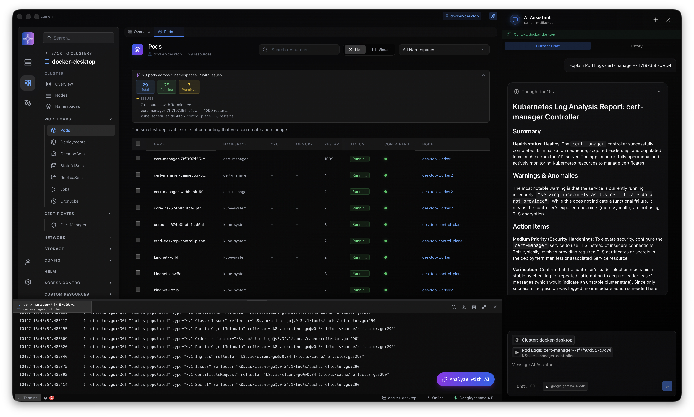

<div align="center">

# Lumen

[](./package.json)
[](./LICENSE)
[](https://www.electronjs.org/)
[](https://react.dev/)
[](https://www.typescriptlang.org/)
[](https://www.apple.com/macos/)
[](./CODESIGNING.md)
[](https://vitejs.dev/)

</div>

<br/>

**The Kubernetes cockpit that keeps up with you.** Lumen puts live cluster state, deep operational detail, and a context-aware AI in one polished desktop app—so you diagnose faster, collaborate cleaner, and spend less time context-switching between terminals, tabs, and cloud consoles.

Stop duct-taping half a dozen tools together. Spin up production-grade visibility, sane defaults, and an assistant that actually speaks *your* cluster—whether that’s Gemini or Bedrock in the cloud or a **local LLM** on your machine—without leaving your flow.



*Lumen AI: ask questions across resources and logs without losing where you are in the cluster.*

Built for teams who ship on Kubernetes—not for fighting the UI—**Electron** · **React** · **TypeScript** · blazing watches and a UX built for clarity first.

---

## Highlights

| Area | What you get |
|------|----------------|
| **Clusters** | Work across contexts from your kubeconfig; pin favorites for instant switching |
| **Live data** | Watches for pods, deployments, nodes, CRDs/custom resources (where supported), and more |
| **AI** | Revamped assistant: explain resources and logs; Google Gemini, AWS Bedrock, or **local** OpenAI-compatible models |
| **Accounts** | Optional sign-in and org flows (sync and collaboration-oriented features evolve here) |
| **Cloud** | AWS-aware views — EKS, EC2/VPC signals, Granted-friendly profiles, audits where wired |
| **Ops** | Log streaming with search/export, YAML editing, exec terminal, port forwarding |

## Features

### Workloads & resources

- **Workloads**: Pods, Deployments, ReplicaSets, DaemonSets, StatefulSets, Jobs, CronJobs — with detail drawers and safe edit paths where applicable  
- **Network**: Services, Ingress, IngressClasses, Endpoint(Slice)s, NetworkPolicies  
- **Config & secrets**: ConfigMaps and Secrets  
- **Access**: Roles, RoleBindings, ClusterRoles, ClusterRoleBindings, ServiceAccounts  
- **Storage & infra**: PVCs/PVs, StorageClasses — plus CRDs and custom objects for supported types  
- **Global operations**: Unified delete YAML flows, deployment revision history & diffs where enabled  

### Operations & UX

- **Logs**: Stream container logs with search and download-friendly workflows  
- **Terminal**: kubectl-style interaction and pod exec flows from the UI  
- **Port forwarding**: Start/stop forwards with clear lifecycle  
- **YAML**: In-app editor aligned with cluster objects  
- **Themes**: Dark-first UI with multiple accents (including charcoal-style defaults)

### Observability helpers

Context engine hooks for summaries and anomaly hints (availability depends on configuration).  
Structured notifications for important cluster events where enabled.

### AI assistant

Cluster-aware prompting: summarize resources, reason about failures, inspect log snippets — with configurable provider (**Gemini**, **Bedrock**, or **local** LLM URL). Conversation history persists per session workflows.

See **[CHANGELOG](./CHANGELOG.md)** and **[release notes](./release-notes/)** for version-by-version changes.

## Tech stack

| Layer | Choices |
|--------|---------|
| App shell | [Electron](https://www.electronjs.org/), [vite-plugin-electron](https://github.com/electron-vite/vite-plugin-electron) |
| UI | [React](https://react.dev/), [Tailwind CSS](https://tailwindcss.com/), [Framer Motion](https://www.framer.com/motion/) |
| Build | [Vite](https://vitejs.dev/), TypeScript `strict` |
| State | [Zustand](https://github.com/pmndrs/zustand) (and focused React hooks) |
| Kubernetes | [@kubernetes/client-node](https://github.com/kubernetes-client/javascript), `kubectl` integration where applicable |
| AI | AI SDK–style streaming to Gemini / Bedrock / OpenAI-compatible (`local`) providers |

## Getting started

### Prerequisites

- **[Node.js](https://nodejs.org/)** ≥ 18  
- **[npm](https://www.npmjs.com/)** (bundled with Node)  
- A valid **`kubectl`** context (`~/.kube/config`)  

### Clone & install

```bash
git clone <repository-url> lumen
cd lumen
npm install
```

### Development

```bash
npm run dev
```

Runs the Vite dev server and launches the Electron app with hot reload for the renderer.

### Production build

```bash
npm run build
```

Artifacts land under **`release/`** and related build dirs per `electron-builder` config (paths may vary by branch).

### Project layout

```
electron/          # Main process: IPC, kube access, filesystem, integrations
electron/preload.ts
src/               # Renderer: React UI, stores, dashboards, AI panels
vite.config.ts
```

## Signing & distribution (macOS)

Official release builds use Apple **code signing** and **notarization**. Forks and local builds typically run unsigned; to ship your own binaries you need your own Apple Developer credentials and entitlement setup.

Details: **[CODESIGNING.md](./CODESIGNING.md)** and **`electron-builder`** config in-repo.

### Port forwarding

Requires a working **`kubectl`** and kubeconfig pointing at reachable API servers.

## Contributing

Issues and PRs welcome. Please keep changes focused and match existing patterns in the codebase.

## Code of conduct

Be respectful and inclusive in issues, reviews, and chat. Harassment and discriminatory behavior are not tolerated.
